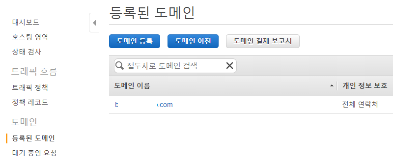
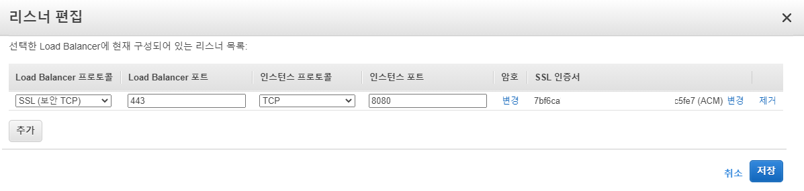

## Route53 도메인 연결

### 1. 도메인 구매

1. Route53 - 등록된 도메인 - 도메인 등록 이동
2. 원하는 도메인 구매
3. 승인 완료 시 도메인 사용 가능

------

### 2. 도메인 연결

1. Route53 - 호스팅 영역 - 호스팅 영역 생성
2. 등록된 도메인의 NS값을 호스팅 영역 레코드 세트 NS에 등록
3. 레코드 생성 - A-IPv4 주소 유형 선택 - 값 란에 인스턴스 IP 입력
4. 연결 완료

-----

### 3. HTTPS 인증서 등록

1. Certificate Manager - 인증서 관리자 이동

2. 인증서 요청 - 공인 인증서 요청 선택

3. 도메인 이름 추가

4. DNS 검증 or E-mail 검증 선택 ( DNS 검증으로 진행 )

5. 인증서 요청 완료 선택

6. Certificate Manager - 인증서 관리자에서 등록한 도메인 선택

7. 상태란에 도메인을 클릭 하면 아래에 Route 53에서 레코드 생성 선택

   ( Route53에 도메인을 등록 해줘야 DNS 검증이 가능하다. )

8. DNS 검증이 완료되면 인증서 사용 가능

------

### 4. 로드 밸런서 적용

1. EC2 - 로드 밸런서 - Load Balancer 생성

2. 사용할 유형 선택 ( **Classic Load Balancer** 으로 진행)

3. 이름 및 프로토콜 정의 (프로토콜은 이후에 수정 가능) - 보안 그룹 할당 - 상태 검사 구성

   \- EC2 인스턴스 추가 (연결) - 생성 완료

4. 보안 그룹에서 인바운드 규칙 설정

   \- HTTP 80포트, HTTPS 443포트, SSH 22포트 외 설정

5. 로드 밸런서 리스너 편집

6. Route53에 등록한 레코드 세트 내용 변경

   기존 : 값 ( xxx.xxx.xxx.xxx )

   변경 : 별칭 ( 로드 밸런서 별칭 선택 )

-----

### 5. 완료

웹 브라우저에 도메인 접속하여 정상 동작하는지 확인 한다 !

이후 작업 : [Ubuntu Nginx 설치 및 설정](/Ubuntu/ubuntu_nginx설치_및_설정.md)