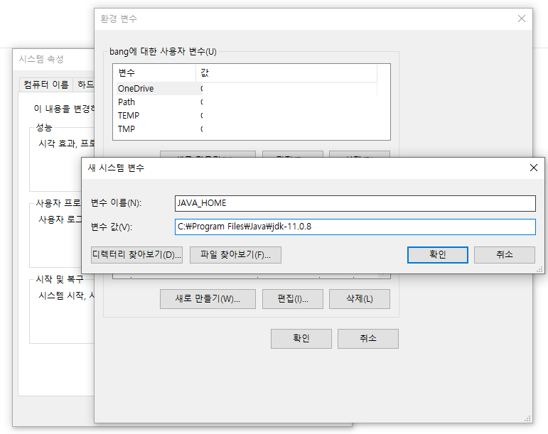
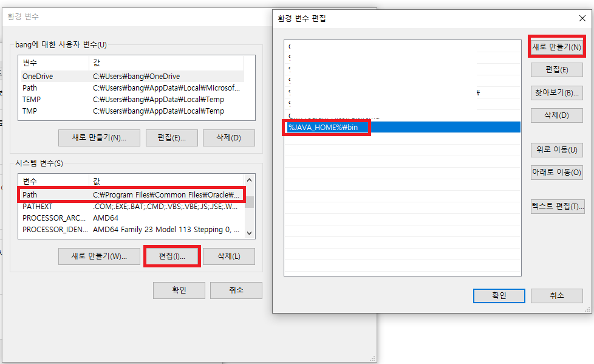
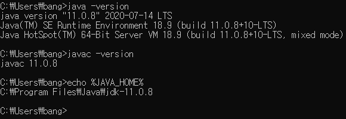

# Java 설치 ( JDK 설치, 환경변수 설정)

### 1. JDK 설치

1. [https://www.oracle.com/technetwork/java/javase/downloads/index.html](https://www.oracle.com/technetwork/java/javase/downloads/index.html) 링크 이동
2. 원하는 JDK 버전을 다운로드 받아서 설치

------

### 2. 환경변수 설정

1. 시스템 환경 변수 편집 - 고급 - 환경 변수 - 시스템 변수 새로 만들기에서 아래와 같이 경로 입력

   

2. 시스템 변수에서 Path 편집 - 새로 만들기 - ""%JAVA_HOME%\bin" 입력

   

---

### 3. 설정 확인

1. cmd 창에서 명령어 입력시 아래처럼 되어야 설정 정상

   

---

차 후, 다른 버전의 JDK를 사용하고 싶다면 시스템 변수의 JAVA_HOME 값을 변경해주면 된다.